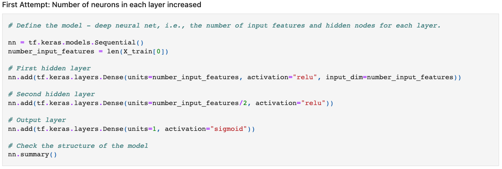
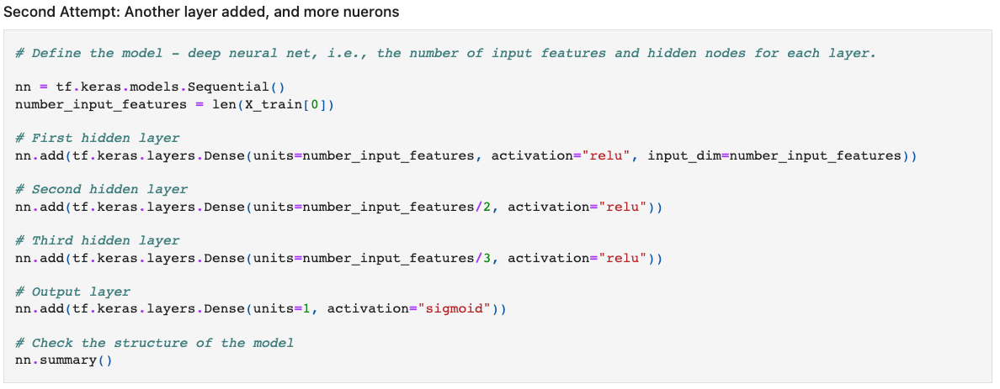
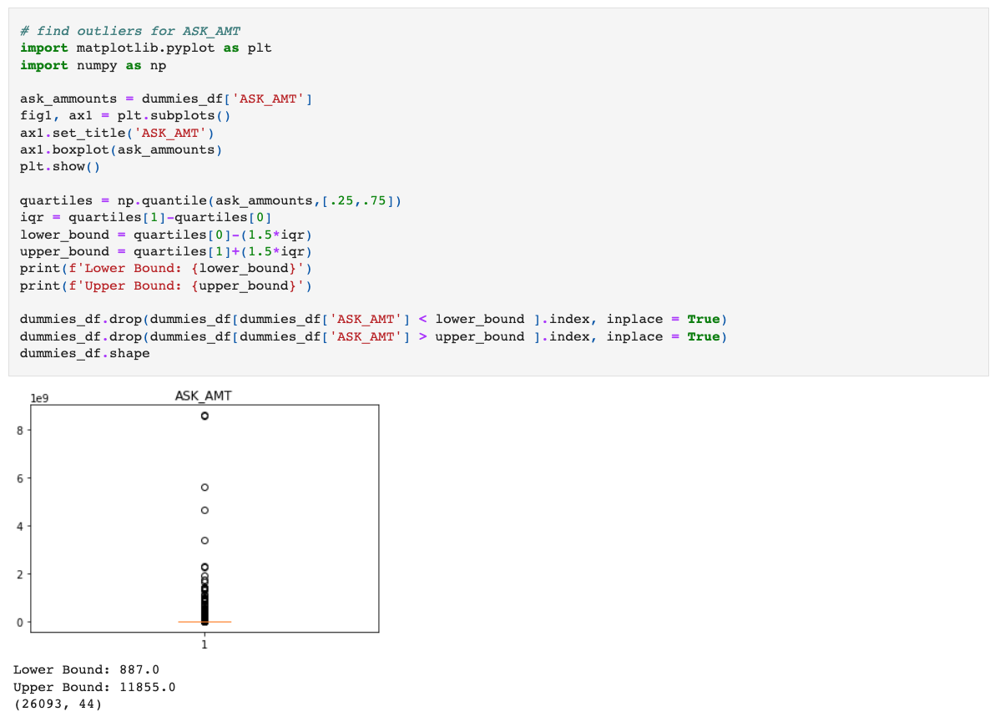
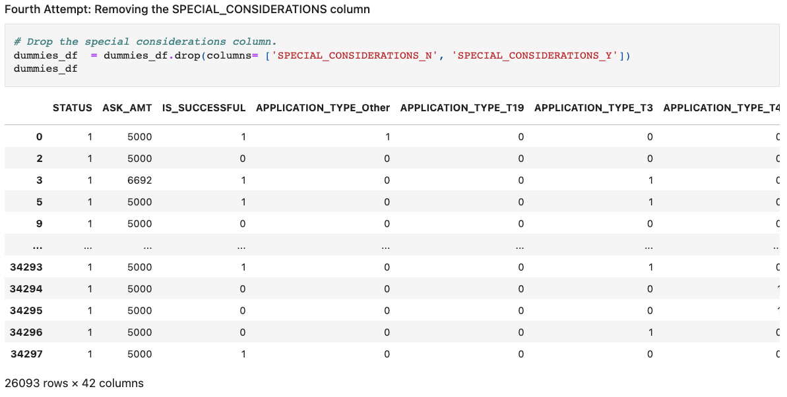

# Deep Learning: Charity Funding Predictor

In this project, a binary classifier neural network is developed. The neural network  is intended to predict whether or not organizations that apply for funding from Alphabet Soup will be successful. 

The Neural network is trained on a CSV containing over 34,000 organizations funded by Alphabet Soup over the years.

5 different neural network were compiled and trained. Throughput the project, steps were taken to optimize the neural network's performance and accuracy score, in both the data processing and training stages. 

### Preprocessing Stage:

* Target variable: IS_SUCCESSFUL — Was the money used effectively
  
* Features used in training the model:
    * In the first 4 attempts:
        * **APPLICATION_TYPE**—Alphabet Soup application type
        * **AFFILIATION**—Affiliated sector of industry
        * **CLASSIFICATION**—Government organization classification
        * **USE_CASE**—Use case for funding
        * **ORGANIZATION**—Organization type
        * **STATUS**—Active status
        * **INCOME_AMT**—Income classification
        * **SPECIAL_CONSIDERATIONS**—Special consideration for application
        * **ASK_AMT**—Funding amount requested

    * In the 5th attempt, **SPECIAL_CONSIDERATIONS** was removed.

* Variables removed from the input data:
    * **EIN** and **NAME**—Identification columns

        
###  Compiling, Training, and Evaluating the Model:

The final Neural network that was most optimized had 3 layers. The input layer had as many neurons as there were features in the processed/dummy data. The second layer had 1/2 as many as the input layer, and the third layer had 1/3 as many as the input layer. The relu activation function was used for all the layers except the output layer which used sigmoid.

After making a few adjustment along the way, the accuracy score of the Neural network was just barely able to reach 75%.

The following step were taken to improve the model's performance:
* In the first attempt, data was binned into an "other category" for two of the variables: APPLICATION_TYPE and CLASSIFICATION. These 2 variable had many categories, and some categories represented such a small amount of the data that is was optimal to combine them into an "other" category. This reduced the number of features in the dummy data significantly. After the first attempt with binning, on the second attempt, the bins were made to include even more categories and further reduce the number of features. 

* The second attempt involved increasing the number of neurons in each layer, as a trial and error approach. This made little no change in the accuracy score. From 0.7284 to 0.7238 was a slight decline in accuracy. 

* During the third attempt, a 3rd hidden layer was added. There are many features in the data, so it's unlikely that only the 2 hidden layers in the first attempts would create an accurate model. The accuracy score in thre third attempt was 0.7257. This still was not an improvement from the first attempt though. 

* In the fourth attempt, outliers were identified in the ASK_AMT feature, and those rows were removed from the processed data. This significanlty improved the accuracy score, which went up to 0.7498.

* For the final attempt, the SPECIAL_CONSIDERATIONS feature was removed from the data, because it may have been creating noise. It may be that special considerations is wide-ranging, and there could be many factors that influence whether or not certain types of special considerations positively or negatively affect an organization's success. The accuracy score from this attempt was 0.7503. 

# Summary: 

In the end, the most effective step in optimizing the model, was removing outliers. And even though the accuracy score was at 75% by the final attempt, not much improvement was made throughout all the trial and error that was involved in this project. A better approach may have been to use a keras tuner to create the neural network model. The keras tuner would do most of the trail and error on its own, saving a lot of time spent on adjusting the number of hidden layers, number of neurons, and different hyper-parameters.
